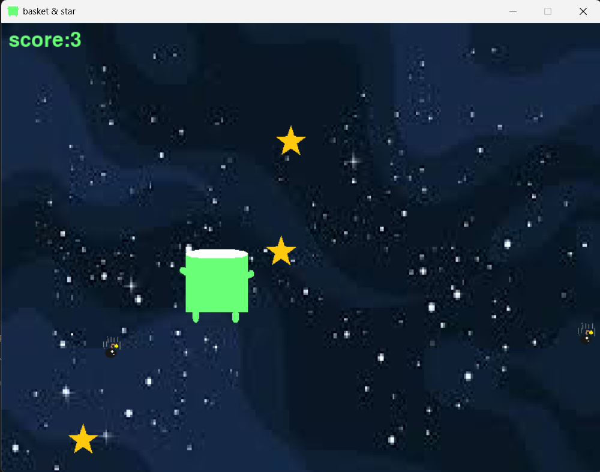

# Basket & Star

A simple 2D arcade game built with Python and Pygame where the player controls a basket to catch falling stars while avoiding bombs.

## Description

Basket & Star is a 2D arcade game developed with Python and Pygame.

The player controls a basket horizontally using the Left and Right Arrow keys.

Stars and bombs continuously fall from the top of the screen. Catching a star increases the score, while missing a star or hitting a bomb decreases the score.

The game ends when the score reaches `-10`.

## Project Preview

### Gameplay



## Technologies

* Python
* Pygame

## Features

* Horizontal basket movement
* Falling stars
* Falling bombs
* Collision detection
* Score tracking
* Random object positions
* Catching stars to increase the score
* Missing stars decreases the score
* Hitting bombs decreases the score
* Game-over condition
* Space-themed background
* Custom game icon

## How It Works

The game creates a window with a space-themed background and places a basket, stars, and bombs on the screen.

The game starts with:

* 3 stars
* 3 bombs
* An initial score of `0`

### Basket Movement

The basket can be moved horizontally using the arrow keys.

| Key         | Action     |
| ----------- | ---------- |
| Left Arrow  | Move left  |
| Right Arrow | Move right |

The basket is restricted to the visible game area.

### Stars

Three stars fall from the top of the screen.

When the basket catches a star:

```text
Score +1
```

The star is then returned to the top at a random horizontal position.

If a star falls below the screen without being caught:

```text
Score -1
```

The star is then repositioned at a random horizontal position.

### Bombs

Three bombs also fall from the top of the screen.

When a bomb collides with the basket:

```text
Score -1
```

The bomb is then returned to the top at a random horizontal position.

### Game Over

When the score reaches:

```text
-10
```

the game displays a game-over message and stops running.

## Scoring

| Action       | Score |
| ------------ | ----: |
| Catch a star |    +1 |
| Miss a star  |    -1 |
| Hit a bomb   |    -1 |

## Challenges

Some of the main challenges in this project were:

* Managing multiple falling objects
* Detecting collisions between the basket and objects
* Managing the score
* Randomizing object positions
* Handling the game-over condition
* Working with images and Pygame rendering
* Keeping multiple game objects updated inside the game loop

## What I Learned

Through this project, I practiced:

* Creating a game loop with Pygame
* Handling keyboard input
* Detecting collisions
* Working with images
* Generating random positions
* Managing game state
* Using lists to manage multiple objects
* Implementing a score system
* Creating a game-over condition

## Status

Completed as a Python and Pygame practice project.

## Future Improvements

* Add sound effects
* Add a start menu
* Add a restart option
* Improve the difficulty system
* Add a high-score system
* Improve the game-over screen
* Add more visual effects
* Display the player's name in the game

## Requirements

* Python 3.x
* Pygame

## Installation

Install Pygame using:

```bash
pip install pygame
```

## How to Run

Run the game with:

```bash
python main.py
```

## Project Structure

```text
Basket-Star/
│
├── assets/
│   └── preview/
│       └── game_play.png
│
├── basket_green.png
├── bomb.png
├── main.py
├── space.jpg
├── star.png
└── README.md
```

## Concepts

* Python Programming
* Pygame
* Game Loop
* Keyboard Input
* Collision Detection
* Randomization
* Lists
* Game State Management
* Score Systems
